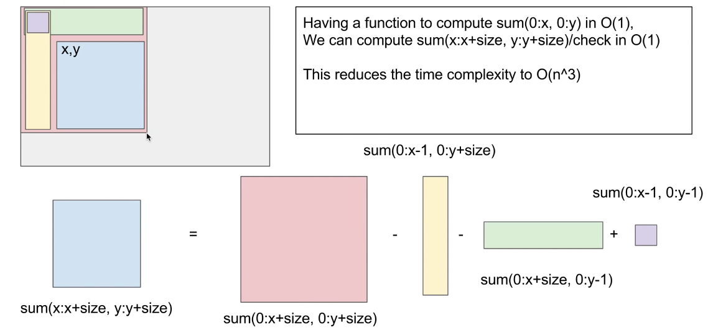
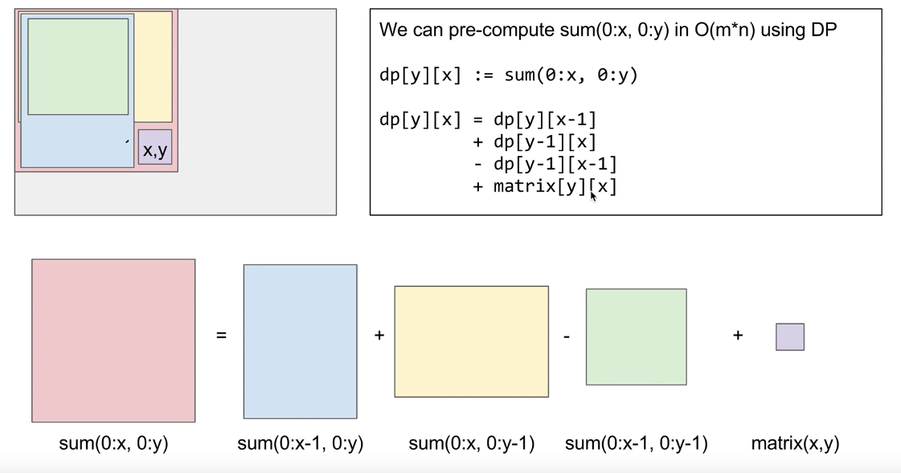
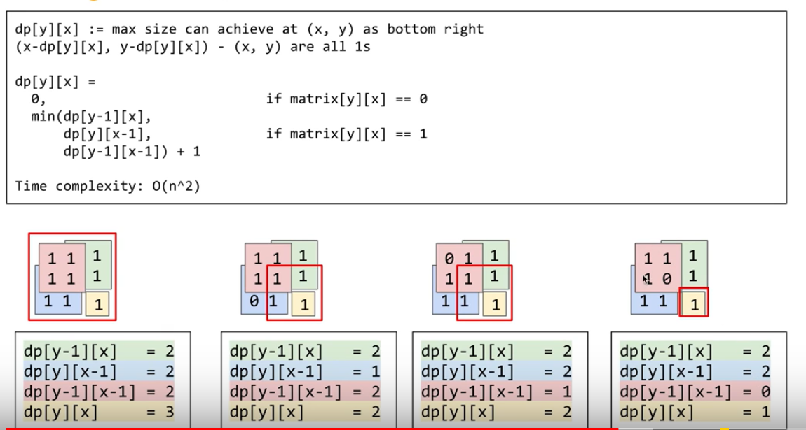

## 221. Maximal Square
```java
Given a 2D binary matrix filled with 0's and 1's, find the largest square containing only 1's and return its area.

Example:

Input: 

1 0 1 0 0
1 0 1 1 1
1 1 1 1 1
1 0 0 1 0

Output: 4

```

### Explanation
- brute force method is to check every start point with different size(like, size 1 square, 2*2, 3*3) (O(m*n)*min(m, n))
- then check the square are all 1 O(m*n)
- But there are some duplicate compuataion when we check size 3, since we already check size 2 square
- So using dp here
- image 1 , using image 2 info to calculate a sum(x:x+size, y:y+size)

- image 2, start to build a dp which means sum(0:x, 0:y)

```java
class Solution {
    public int maximalSquare(char[][] matrix) {
        int m = matrix.length;
        if(m==0) return 0;
        int n = matrix[0].length;
        int[][] dp = new int[m+1][n+1];
        //i, j means sum of (0:i, 0:j)-- from image 2
        for(int i = 1; i<=m; i++){
            for(int j = 1; j<=n; j++){
                dp[i][j] = dp[i-1][j]+dp[i][j-1]-dp[i-1][j-1]+matrix[i-1][j-1]-'0';
            }
        }
        int ans = 0;
        //the process is from image 1
        for(int i = 1; i<=m; i++){
            for(int j = 1; j<=n; j++){
                //check different size
                for(int k = Math.min(m-i+1, n-j+1); k>0; k--){
                    //here define k and i, j , tricky
                    int sum = dp[i+k-1][j+k-1]-dp[i+k-1][j-1]-dp[i-1][j+k-1]+dp[i-1][j-1];
                    if(sum==k*k){
                        ans = Math.max(sum, ans);
                    }
                }
            }
        }
        return ans;
        
    }
}
```

### Solution 2:
- dp o(n^n)
- 
- 更正:  讲义中方法2的最后一个case有错误，正确的值为：
- dp[y-1][x] = 1;  dp[y][x-1] = 1; dp[y-1][x-1] = 0; dp[y][x] = 1;
```java
class Solution {
    public int maximalSquare(char[][] matrix) {
        int m = matrix.length;
        if(m==0) return 0;
        int n = matrix[0].length;
        int[][] dp = new int[m+1][n+1];
        int ans = 0;
        for(int i = 1 ; i<=m; i++){
            for(int j = 1; j<=n; j++){
                if(matrix[i-1][j-1]=='0')
                    dp[i][j] = 0;
                else{
                    dp[i][j] = Math.min(Math.min(dp[i-1][j], dp[i][j-1]), dp[i-1][j-1])+1;
                    
                    //System.out.println(dp[i][j]);
                    ans = Math.max(dp[i][j], ans);
                }
            }
        }
        return ans*ans;
    }
}
```

### Similiar QUestion
- 81 maxiam rectangle

### Reference
- [huahua Youtube](https://www.youtube.com/watch?v=vkFUB--OYy0)
- [huahua text](http://zxi.mytechroad.com/blog/dynamic-programming/leetcode-221-maximal-square/)
