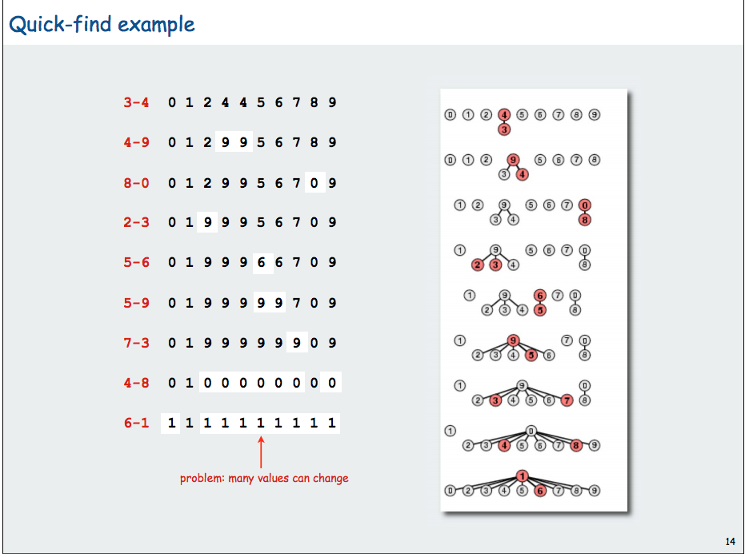
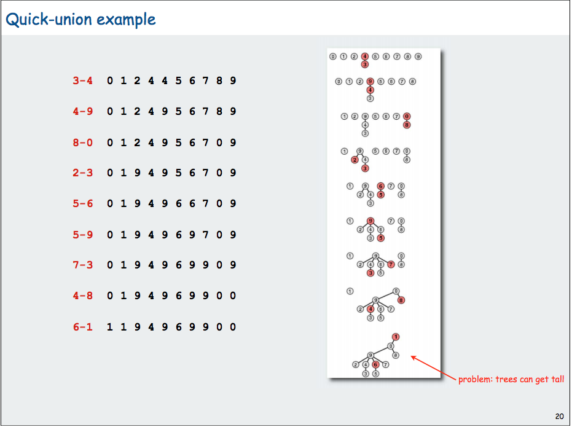

## Summary of Union Find

### Different approach
- quick find (eager approach)
  - find O(1)
  - unite O(n)
```java
public class QuickFind
{
  private int[] id;
  
  //
  public QuickFind(int N)
  {
    id = new int[N];
    for(int i = 0; i<N; i++)
      id[i] = i;
  }
  
  public boolean find(int i, int j)
  {
    return id[p]==id[q];
  }
  
  //make tree flat and trees are only two layers
  public void unite(int p, int q)
  {
    int pid = id[p];
    for (int i=0; i<id.length; i++)
      if(id[i]==pid) id[i] = id[q];
  }
}
```


- quick union (lazy approach) lazy update the root of tree. Tree s can get tall
  - find: O(n) : worst case: since the tree only has one node each layer
```java
public class QuickUnion
{
  private int[] id;
  
  public int root(int i)
  {
    while(i != id[i]) i = id[i];
    return i;
  }
  
  public boolean find(int p, int q)
  {
    return root(p)==root(q);
  }
  
  public void unite(int p, int q)
  {
    int i = root(p);
    int j = root(q);
    di[i] = j;
  }
}
```
 


### optimization
- path compression: just after computing the root of i, set the id of each examined node to root(i);
```java
  public int root(int i)
  {
    while(i!=id[i])
    {
      id[i] = id[id[i]];//update i's parent to its grandparent
      i = id[i]; //go to grandparent since the purpose is to find root
    }
  }
```
- Union by rank or weighted quick-union
```java
//Find: identical to quick union

Union ,odify quick union to
- merge smaller tree into larger tree
- update the sz[] array
if(sz[i] < sz[j]) {id[i] = j; sz[j] += sz[i];}
else {id[j]=i; sz[i] += sz[j];}
```


### Questions
- confusion about quick find and quick union, what does root represent?
- checking the size, what if sz[i] == sz[j] ? 
- time complexixity for ranking and path by compression


### Pseudo Code
- Hua hua youtube, rank and Path compression
```java 
class UnionFindSet:
  func UnionFindSet(n):
    parents = [1..n]
    ranks = [0..0] (n zeros)
    
  func Find(x):
    if x!=parents[x]:
      parents[x] = Find(parents[x])
    return parents[x]
   
  func union(x, y):
    px, py = Find(x), Find(y)
    if ranks[px] > ranks[py]; parents[py] = px
    if ranks[py] > ranks[px]; parents[px] = py
    if ranks[px] == ranks[py]:
      parents[py] = px
      ranks[px]++

```
--------------------------------------------------------------------------

### resued strucutr in java
```java
class UnionFindSet{
    int[] parent; 
    int[] rank;
    UnionFindSet(int n){
        parent = new int[n];
        rank = new int[n];
        for(int i = 0; i<n; i++){
            parent[i] = i;
            rank[i] = 0;
        }
    }
    int root(int i){
        while(i!=parent[i]){
            parent[i] = parent[parent[i]];//path compression
            i = parent[i];
        }
        return parent[i];
    }

    void union(int i, int j){
        int pi = root(i);
        int pj = root(j);
        if(pi==pj) return;

        if(rank[pi]<rank[pj]){
            parent[pi] = pj;
        }else if(rank[pi]>rank[pj])
            parent[pj] = pi;
        else {
            parent[pj] = pi;
            ++rank[pi];
        }
    }
}
```


### Leetcode problems


### reference
- [princeton algorithm class](https://www.cs.princeton.edu/~rs/AlgsDS07/01UnionFind.pdf)
- Union Find by Hua Hua in [Youtube](https://www.youtube.com/watch?v=VJnUwsE4fWA&t=319s)
- https://zxi.mytechroad.com/blog/data-structure/sp1-union-find-set/ amortized
